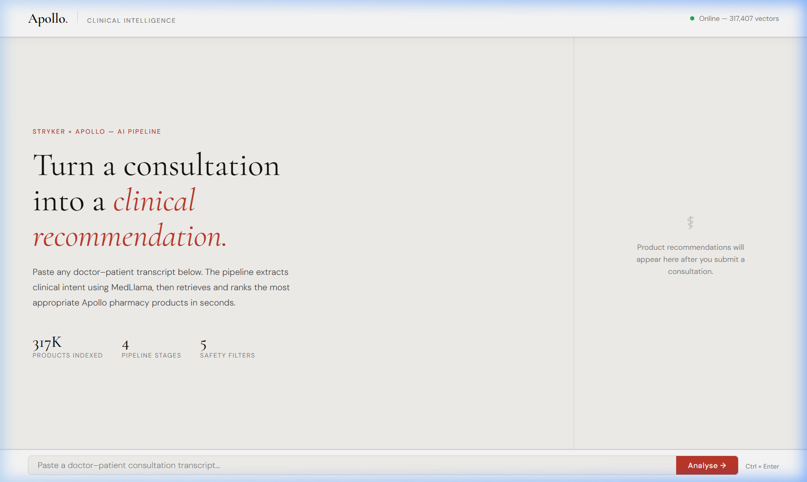

<div align="center">

<br/>

# Apollo Clinical Intelligence

### AI-powered clinical product recommendation engine for pharmacy care

*Stryker × Apollo Hospitals — THIT Solvathon 2025*

<br/>

[](https://python.org)
[](https://fastapi.tiangolo.com)
[](https://github.com/facebookresearch/faiss)
[](https://docker.com)
[](LICENSE)

<br/>



</div>

---

## Overview

**Apollo Clinical Intelligence** is a four-stage AI pipeline that takes a raw doctor–patient consultation transcript and returns a ranked, safety-filtered list of recommended products from the Apollo pharmacy catalog.

It connects a locally-running medical LLM (JSL MedLlama 3 8B via LM Studio) with a high-speed FAISS vector index built over 317,000+ Apollo products, wrapped in a production-grade FastAPI backend and a clean editorial frontend.

---

## Pipeline Architecture

```
┌─────────────────────────────────────────────────────────────────────┐
│                       APOLLO CLINICAL PIPELINE                      │
├──────────┬──────────────┬──────────────────┬───────────────────────┤
│  STAGE 1 │   STAGE 2    │    STAGE 3       │       STAGE 4         │
│          │              │                  │                       │
│  Catalog │  Embedding   │  NLP Extraction  │  Retrieval + Ranking  │
│  Pre-    │  + FAISS     │  (MedLlama via   │  (FAISS search +      │
│  processing│  Indexing  │   LM Studio)     │   safety filters +    │
│          │              │                  │   re-ranker)          │
│  CSV     │  317K texts  │  Conversation    │  Candidate pool →     │
│  317K    │  → vectors   │  → JSON intent   │  hard filters →       │
│  products│  → .index    │  (symptoms,      │  diversity scoring →  │
│  → clean │  + .pkl      │   medications,   │  top-K results        │
│  semantic│  metadata    │   allergies…)    │  with reasons         │
│  text    │              │                  │                       │
└──────────┴──────────────┴──────────────────┴───────────────────────┘
```

### Safety Filters Applied at Stage 4

| Filter | Logic |
|--------|-------|
| **Allergy / Contraindication** | Hard-exclude any product containing a blacklisted molecule |
| **Prescription status** | Exclude Rx-only products when no prescription is available |
| **Age group** | Match paediatric / adult / geriatric formulations |
| **Gender suitability** | Filter gender-specific products |
| **Vegetarian** | Exclude non-veg formulations when dietary restriction is declared |

---

## Tech Stack

| Layer | Technology |
|-------|-----------|
| **NLP / LLM** | JSL MedLlama 3 8B v2.0 via [LM Studio](https://lmstudio.ai) (OpenAI-compatible API) |
| **Embeddings** | `all-MiniLM-L6-v2` via SentenceTransformers |
| **Vector DB** | FAISS `IndexFlatL2` (exact nearest-neighbour, ~1ms query) |
| **Backend** | FastAPI + Uvicorn (ASGI) |
| **Frontend** | Vanilla HTML/CSS/JS — Cormorant Garamond + DM Sans |
| **Containerisation** | Docker + Docker Compose |
| **Audit Logging** | Structured JSON logs (FDA 21 CFR Part 11 aligned) |

---

## Prerequisites

| Requirement | Notes |
|-------------|-------|
| **Python 3.10+** (or conda `nlp` env) | Install via [Miniconda](https://docs.conda.io/en/latest/miniconda.html) |
| **LM Studio** | Download from [lmstudio.ai](https://lmstudio.ai) |
| **JSL MedLlama 3 8B v2.0** | Load in LM Studio and start the Local Server on port 1234 |
| **Apollo Catalog CSV** | `End_Pipeline/Main_Apollo_Catalog.csv` (not included in repo — large file) |
| **Docker** (optional) | For containerised deployment |

---

## Getting Started

### Option A — Run Locally (Recommended for Development)

**1. Clone and set up environment**
```bash
git clone https://github.com/your-org/Apollo_THIT_Solvathon.git
cd Apollo_THIT_Solvathon

# Install dependencies into the nlp conda environment
conda activate nlp
pip install -r final_implementation/requirements.txt
pip install aiofiles python-multipart
```

**2. Place your catalog CSV**
```
Apollo_THIT_Solvathon/
└── End_Pipeline/
    └── Main_Apollo_Catalog.csv   ← place here
```

**3. Start LM Studio**
- Open LM Studio → load **JSL MedLlama 3 8B v2.0**
- Click **Local Server → Start Server** (port 1234)

**4. Run Stage 1 — Build semantic text catalog** (~15 seconds)
```cmd
set PYTHONIOENCODING=utf-8
set PYTHONPATH=C:\path\to\Apollo_THIT_Solvathon
C:\path\to\miniconda3\envs\nlp\python.exe final_implementation/data_pipeline/semantic_text_creation.py
```

**5. Run Stage 2 — Build FAISS vector index** (~20-30 minutes on CPU)
```cmd
C:\path\to\miniconda3\envs\nlp\python.exe final_implementation/data_pipeline/vector_index_builder.py
```
> You will see a live progress bar showing the embedding throughput. FAISS index and metadata are saved to `final_implementation/artifacts/`.

**6. Start the API server**
```cmd
C:\path\to\miniconda3\envs\nlp\python.exe -m uvicorn final_implementation.api.main:app --host 0.0.0.0 --port 8000 --reload
```

**7. Open the app**

👉 **http://localhost:8000/app/**

---

### Option B — Docker (Production)

> **Prerequisites:** Complete Steps 4 & 5 above locally first to generate the FAISS artifacts. Then:

```bash
# Copy the example env file
cp .env.example .env

# Build and start the container
docker compose up --build
```

The container mounts your local `final_implementation/artifacts/` directory as a volume, so the heavy indexing step is skipped.

Open **http://localhost:8000/app/**

#### First-Run Docker (no pre-built artifacts)

If you want the container to build the FAISS index from scratch, uncomment the catalog CSV volume mount in `docker-compose.yml` and the container's entrypoint will run Stage 1 & 2 automatically (~30 min).

---

## Using the App

Paste any doctor–patient consultation into the input bar. Try these examples:

### Example 1 — Diabetic Patient with Respiratory Infection
```
Doctor: Good morning, what brings you in today?
Patient: I'm a 54-year-old male with diabetes. I've had a really bad, dry cough
for the last five days and my throat is sore. I take Metformin 500mg twice daily.
I'm allergic to penicillin and aspirin. I'm a strict vegetarian.
Doctor: Sounds like a viral upper respiratory infection. I recommend dextromethorphan
for the cough — make sure it's a sugar-free formulation given your diabetes —
and paracetamol for throat pain. Continue Metformin.
```

### Example 2 — Paediatric Patient
```
Doctor: How is the little one doing?
Patient (Mother): He is 4 years old and has been running a fever of 101 since last night.
He also has a runny nose. No allergies. He really hates swallowing tablets.
Doctor: I recommend ibuprofen as a suspension or syrup for the fever,
and saline nasal drops for the congestion.
```

### Example 3 — Chronic Pain / Arthritis
```
Doctor: How has your knee pain been?
Patient: I'm a 68-year-old female with osteoarthritis. I've been on OTC ibuprofen
but my stomach is starting to hurt from it.
Doctor: Stop the ibuprofen. I'll prescribe diclofenac sodium topical gel — it works
locally and avoids GI side effects. Prescription is available.
```

---

## Project Structure

```
Apollo_THIT_Solvathon/
├── final_implementation/
│   ├── config/
│   │   └── settings.py          # Central config — all env vars
│   ├── utils/
│   │   └── logger.py            # JSON audit logger (GCP-aligned)
│   ├── data_pipeline/
│   │   ├── semantic_text_creation.py   # Stage 1
│   │   └── vector_index_builder.py     # Stage 2
│   ├── nlp/
│   │   ├── prompts.py           # Clinically-validated LLM prompts
│   │   └── extractor.py         # MedLlama client (retry + JSON guardrails)
│   ├── retrieval/
│   │   ├── lookup_engine.py     # FAISS search + 5 safety filters
│   │   └── ranker.py            # 6-factor weighted scoring + diversity
│   ├── api/
│   │   ├── models.py            # Pydantic v2 request/response schemas
│   │   ├── routes.py            # FastAPI route handlers
│   │   └── main.py              # App factory + lifespan + static files
│   ├── frontend/
│   │   └── index.html           # Editorial UI (no frameworks)
│   ├── artifacts/               # ← gitignored (generated at runtime)
│   │   ├── apollo_fmcg.index
│   │   ├── apollo_fmcg_metadata.pkl
│   │   └── catalog_with_semantic_text.csv
│   └── requirements.txt
├── docs/
│   └── screenshots/
├── Dockerfile
├── docker-compose.yml
├── docker-entrypoint.sh
├── .env.example
├── .gitignore
├── .dockerignore
└── README.md
```

---

## API Reference

The API is self-documented at **http://localhost:8000/docs** (Swagger UI).

### `POST /v1/recommend`
Submit a consultation transcript and receive ranked product recommendations.

**Request body:**
```json
{
  "conversation": "Doctor: ... Patient: ...",
  "top_k": 10
}
```

**Response (abbreviated):**
```json
{
  "status": "success",
  "recommendations": [
    {
      "rank": 1,
      "name": "Benadryl Cough Formula SF (Sugar Free)",
      "molecules": "dextromethorphan",
      "product_form": "Syrup",
      "is_prescription_required": false,
      "composite_score": 0.8241,
      "reasons": [
        "Contains recommended molecule: dextromethorphan",
        "Preferred dosage form: Syrup",
        "100% vegetarian formulation",
        "Non-syrup formulation suitable for diabetic patients",
        "Available over-the-counter (no prescription required)"
      ]
    }
  ],
  "extracted_intent": {
    "symptoms": ["cough", "sore throat"],
    "allergies": ["penicillin", "aspirin"],
    "recommended_medications": [{"name": "dextromethorphan", ...}]
  },
  "pipeline_metadata": {
    "total_processing_time_ms": 4821.3,
    "llm_extraction_time_ms": 3904.1,
    "retrieval_time_ms": 12.4
  }
}
```

### `POST /v1/extract-intent`
Run only the NLP extraction stage (no retrieval). Useful for EHR integrations.

### `GET /health`
Liveness and readiness probe.

---

## Environment Variables

| Variable | Default | Description |
|----------|---------|-------------|
| `LM_STUDIO_BASE_URL` | `http://127.0.0.1:1234/v1` | LM Studio server URL |
| `LM_STUDIO_MODEL` | `local-model` | Model identifier (LM Studio ignores this) |
| `CATALOG_RAW_PATH` | auto-resolved | Path to `Main_Apollo_Catalog.csv` |
| `ARTIFACTS_DIR` | auto-resolved | Directory for FAISS index and metadata |
| `EMBEDDING_MODEL_NAME` | `all-MiniLM-L6-v2` | SentenceTransformer model |
| `FAISS_TOP_K_CANDIDATES` | `50` | FAISS candidates before filtering |
| `FINAL_TOP_K` | `10` | Final recommendations returned |
| `MAX_VECTOR_DISTANCE` | `2.0` | Max L2 distance threshold |
| `LLM_TIMEOUT_SECONDS` | `120` | LLM API timeout |
| `API_PORT` | `8000` | Server port |

See [`.env.example`](.env.example) for the full list.

---

## Compliance Notes

This system is designed with clinical-grade engineering standards:

- **Audit logging** — every extraction, retrieval, and recommendation is logged in structured JSON with a correlation `request_id`, compatible with FDA 21 CFR Part 11 and GCP guidelines.
- **Hard safety rules** — allergy and contraindication exclusions are deterministic code, never overridden by an ML similarity score.
- **Zero hallucination guard** — the LLM extraction prompt explicitly instructs the model to set fields to `null` or `[]` rather than invent values. Unparseable LLM output raises a `ClinicalExtractionError` and is rejected.
- **PII notice** — in a production deployment, patient names and identifiers should be de-identified before reaching this pipeline.

---

## License

[MIT License](LICENSE) — © 2025 Stryker × Apollo Hospitals
